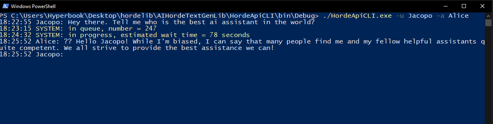

# HordeAiTextGenLib
Simple library written in C# to connect to HordeAI api, with cli simulating a chat

### HordeApi - a library, you can use it independently from cli 

just create a HordeApiCaller object and call **SendGenerateRequest** to start request, then **GetTextStatus** to check if it has completed, once finished **GetTextStatus** also contains the generated text in **generations[0].text**.

### HordeApiCLI - console interface to library, with some logic for a chat with assistant loop
example call: ./HordeApiCLI.exe -k 0000000000 -u Jacopo -a Alice -p "Add answers of Alice in dialogue. Generate only Alice answers. Answers should be always thoughtful and precise. \n ------------------- \n" -d true -e false
#### Options

`Options` contains all CLI arguments, all have default values

- **apiKey** (-k): Set API key. If not set, it defaults to the guest API key: `0000000000`.
- **user** (-u): Set user nickname, defaults to `User`.
- **assistant** (-a): Set assistant nickname, defaults to `Assistant`.
- **prompt** (-p): Set initial prompt to describe assistant's behavior, defaults to few sentence long description of an ai assistant role.
- **showDebug** (-d): Print system outputs about retrieving API calls and queue wait time, defaults to `true`.
- **showErrors** (-e): Print error outputs about connection failures, defaults to `true`.

Example use on default settings should look like this

